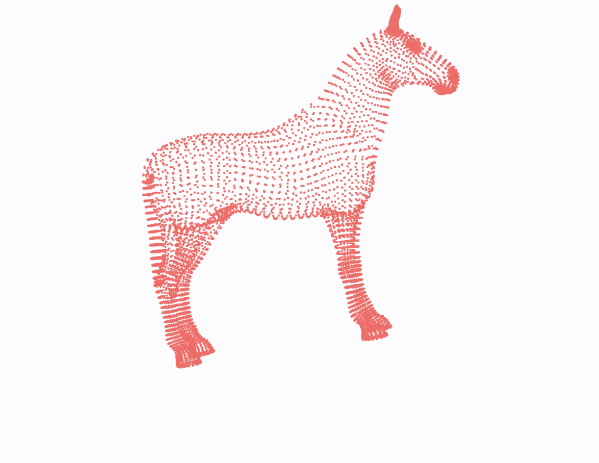

# Creative-Coding-Geometry-and-OpenGL-with-Audio
*- Jake Morgan -*

## WELCOME - This repo contains code and documentation for:##

1. ### Dimensionality. (Audio Sculpting)
2. ### Infinite Space. (Spatial Data -> Reverb)
3. ### _tri. (The Prototype M4L Device)

                                                  
                                                  
                                                  
                                                  
                                   ⠿⠉             
                                  ⠯⣻              
                                 ⠁⡿⢯              
                                 ⣽⣯⠉              
                                ⡯⣯⢿               
                               ⠯⣟⣯⢯               
                              ⠁⡿⣯⣟⠛               
                              ⣽⣯⣯⢿                
                             ⡯⣯⣯⣯⡯                
                           ⠉⢯⣟⣯⣯⣟⠉                
                         ⠉⣾⡿⣯⣯⣯⣯⢿                 
                ⠁⠁⠁    ⠉⢯⡿⣯⣯⣯⣯⣯⣯⣽                 
               ⣾⡿⡿⡿⣻⢯⢯⣾⣻⣟⣯⣯⣯⣯⣯⣯⣯⢯                 
               ⠉⡿⣯⣯⣟⣻⣻⣻⣟⣯⣯⣯⣯⣯⣯⣯⣯⠿                 
                ⠯⣟⣯⢿⢯⣽⣟⣯⣯⣯⣯⣯⣯⣯⣯⣟⠛                 
                 ⠯⣽⠯⠛⢿⣯⣯⣯⣯⣯⣯⣯⣯⣯⡿⠉                 
                  ⠁⠁⢯⣯⣯⣯⣯⣯⣯⣯⣯⣯⣯⢿⠁                 
                   ⠛⡿⣯⣯⣯⣷⣷⣯⣯⣯⣯⣯⣻                  
                   ⣻⣯⣯⣷⣿⣷⣯⣯⣯⣯⣯⣯⣾                  
                  ⡯⣯⣯⣷⣿⣷⣯⣯⣯⣯⣯⣯⣟⢯                  
                 ⠯⣟⣯⣷⣿⣷⣯⣯⣯⣯⣯⣟⣯⣟⣽                  
                ⠉⡿⣷⣷⣷⣯⣯⣯⣯⣯⣟⢿⣻⣟⣯⣻                  
               ⠁⡿⣷⣷⣯⣯⣯⣯⣟⣻⣾⠯⣾⡿⣯⣯⡿⠉                 
              ⠁⡿⣿⣷⣯⣯⣟⣻⠿⠁  ⠁⣽⣯⣯⣯⣯⠯                 
             ⠁⡿⣿⣟⣻⡯⠯⠁      ⠁⢯⣯⣯⣯⣽                 
            ⠁⡿⣯⣾⠉            ⠯⡿⣯⣟⠉                
            ⣾⡯⠁               ⠁⢯⣯⢯                
                                ⠉⣾⠁               
                                 ⠁                
                                                  
                                                  
                                                  
                                                  
                                                  
                                                  
